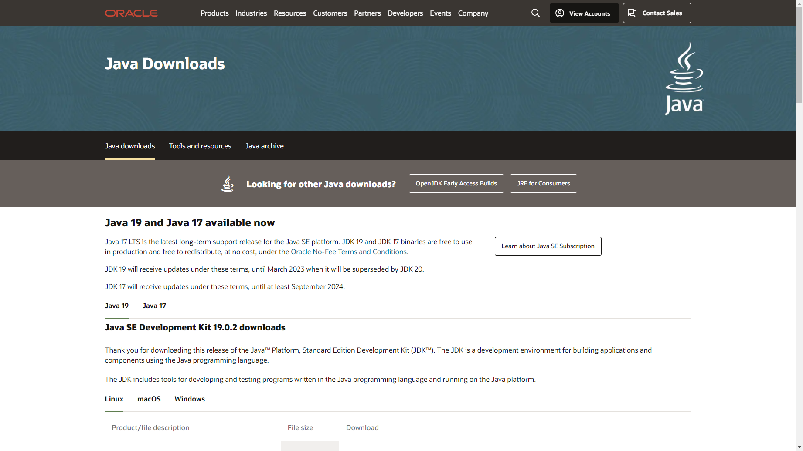

# Start

Java is a programming language based on Object-oriented programming (OOP), and is used by many industries/application

To start of, install Java JRE to run our project and JDK to compile the application

You can choose to install Oracle Java or OpenJDK to compile the application, of course you can install both

 

## **Oracle Java**

[Oracle Java](https://www.oracle.com/id/java/technologies/downloads/)

 

## **OpenJDK**

[OpenJDK](https://openjdk.org/)

